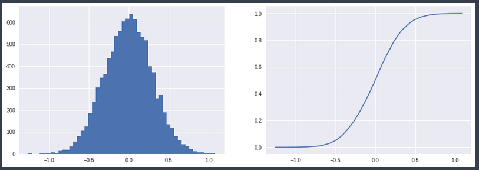
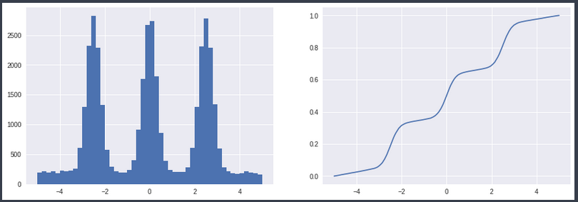
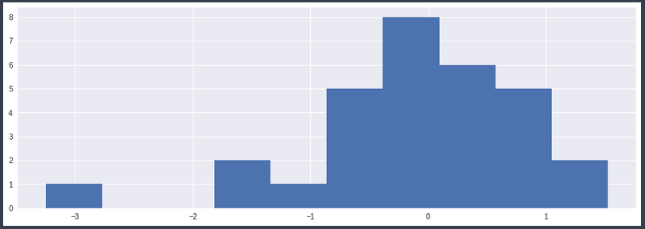
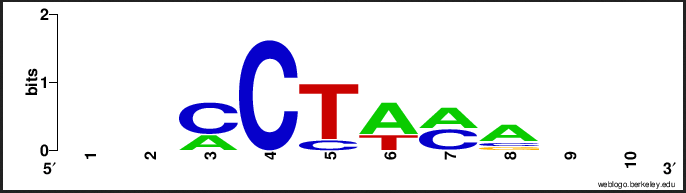

# Background

## Potential Application of SkinnyDip

In the previous section we described the current state of motif finding algorithms and brought up some of the current challenges faced in motif discovery, namely we mentioned robustness to noise, ability to handle different sizes of motifs, efficient with increasing sequence sizes, and simplicity of use. From outside the field of biology, there is an algorithm that seems to match those requirements well. The SkinnyDip algorithm, developed by Maurus et al. in 2016, is specifically designed to be robust to noise, out-performing contemporary noise-robust algorithms such as DBSCAN and expectation maximization algorithms [@maurus_skinny-dip:_2016]. SkinnyDip only takes a single parameter `alpha` which corresponds to limit at which we determine that particular set of data's p-value is unimodal [@maurus_skinny-dip:_2016]. Both the lack of any other tuning parameters and generality of its one, aid in making SkinnyDip simple to use. Moreover, as Maurus and Plant write "Practically, its run-time grows linearly with the data." [@maurus_skinny-dip:_2016].

So, considering all of SkinnyDip's amazing features, why has this algorithm not yet been applied to motif discovery? With these features also come some limitations. SkinnyDip was developed to cluster continuous numeric distributions, data significantly removed from the symbolic letter-based format common to genomic and proteomic datasets. SkinnyDip also has a firm requirement that its query be unimodal, this is not a guarantee that we can make about motifs, the largest antithesis of this requirement being spaced-dyad motifs [@das_survey_2007] which by definition are bi-modal at least. Single motifs, due to there potential for mutation, might also appear bi-modal if their middle positions are less conserved than their starting and ending positions.  These are significant challenges, but we can perhaps find ways to address these issues if we specify how the SkinnyDip algorithm works. 

## How SkinnyDip Functions

The SkinnyDip algorithm is able to find multi-dimensional clusters in continuous numeric distributions. It can perform this feat by composing itself of several layers. At its heart is the Hartigan Test of Unimodality [@hartigan_dip_1985], this formal statistical test is not terribly well known outside of its statistical circles, but does provide some useful features including speed, possessing a $O(n)$, and non-parametric applicability to any distribution that meets the requirement of being unimodal, for example Gaussian, Beta, Uniform, etc.. Using this test of unimodality is the second layer of SkinnyDip, UniDip. UniDip recursively performs the dip-test along one dimension isolating modes. The final layer is SkinnyDip with recursively runs UniDip across each dimension and then merges clusters from each dimension.

### Hartigan's Dip Test of Unimodality

In more detail, Hartigan's dip-test makes use of a distribution's empirical cumulative distribution function (ECDF). As can be seen from the plot below, this function's gradient increases approaching a mode or peak in the histogram, and decreases after. In unimodal data, this creates a stretched S shape.

  


The dip-test performs a best fit to this shape, finding an minimal width path such that, from left to right on the `x` axis, in the beginning the gradient only increases until it reaches a point where-after the gradient only decreases. The dip statistic is defined as the width of this path divided by two, and does not vary with shifting or scaling.

Upon return of this dip statistic we may compare against a suitable unimodal null distribution, Hartigan suggests that the Uniform distribution is preferred [@hartigan_dip_1985], to obtain a p-value. If the p-value is greater than `alpha` we accept the null hypothesis that the distribution is unimodal, otherwise we accept that alternative that the distribution is _at least_ bi-modal. 

The dip statistic and p-value are not enough in themselves to help us locate modes. Thankfully, the dip-test also provides a modal interval, which specifies a lower and upper index to the mode.

### UniDip, Recursive Application of the Dip Test

UniDip takes us the next step by allowing us to recursively finding modes. Roughly speaking, we start by dipping along the entire single dimensional set of data. If the data is unimodal than we should return the set of data as the modal interval. otherwise we should perform UniDip within our found modal interval. If our left most modal interval plus the rest of the data to the left is at least bimodal we should recurse to the left. similarly we should recurse right if the right most interval plus the rest of the right data is bi-modal. 

UniDip in condensed pseudo-code:

```
INPUT: X, (1d sorted vector)
	   alpha, (significance level)
	   gamma, (is modal interval always true at start)

OUTPUT: set of modal intervals 
	    where a modal interval := (lower index, upper index)

UniDip(X, alpha=0.05, gamma=True)
	dip, pval, li, ui = DipTest(X)
	
	if pval > alpha return (if gamma) ? (X[0], X[-1]) : (li, ui)
	
	// recurse into interval
	Mm = UniDip(X[li, ui], alpha, gamma=True)
	
	// find left and right most intervals
	U = min(Mm, key=>(t) t[-1]); L = max(li, key=>(t) t[0])
	
	// check if left side is at least bi-modal when including 
	// the left most mode then do same check but to the right
	pL = DipTest(X[X <= U]); pU = DipTest(X[X >= L])
	
	// recurse left if at least bi-modal
	Ml = (if pL <= alpha) ? UniDip(X[X < li], alpha, False) : ()
	
	// recurse right if at least bi-modal
	Mu = (if pU <= alpha) ? UniDip(X[X > ui], alpha, False) : ()
	
	return Mm & Ml & Mu
```

At the end of running this algorithm we obtain the union of the all our recursive steps. We may need to merge any touching intervals, but none should be overlapping.

### SkinnyDip Recursive Application of UniDip

The SkinnyDip algorithm just is another simple layer on top of UniDip. for each dimension run UniDip, from the returned intervals merge all that overlap. Admittedly there is some complications in merging the intervals as we are merging across dimensions, not just along one dimension. But, There is not much beyond that complexity. We do not need to add any more parameters, nor does it significantly increase the time complexity.


## Challenges of Applying UniDip

Earlier in the section we set the challenge of applying SkinnyDip to the motif finding problem, asking if this algorithm could be applied to symbolic data that has no guarantee of being unimodal. At this point we do have some answers. 

In regards to symbolic data, we are in great luck! Note, that the dip-test only requires access to the ECDF of the data. An ECDF can be calculated either directly from the sample of a continuous random variable, or an approximation can be made from the `y` coordinates of the bins in a histogram. 

**Sample from continuous random variable as X:** 

$$
\text{ECDF } = X_1 ... X_n / max(X)
$$

**From histogram bin heights as H:**

$$
\text{ECDF } = \frac{H_k}{n} \in H \text{,  where:} H_k = \sum_{i=1}^{k}H_i
$$ 

In case of a random continuous variable we will inevitably lose detail by grouping points together, but we can reduce this loss by increasing the number of bins. We can likely achieve a similar effect to using bin heights, from using the positional weights from sequence logos.

  


We seem to have a promising approach to applying our algorithm to symbolic data. So, what can we say about guaranteeing unimodality?

SkinnyDip may not ever successfully cluster a true spaced-dyad motif, but our available p-value parameter may allow us enough uncertainty to discover mostly unimodal motifs. The main importance in finding a mode is that it is distinct from the background sequence. While, there is the potential for motifs to be missed due to lack of conservation in there center positions. Given the properties of this algorithm, it also seems likely that we may the start and end separately and given the length of motifs, 8-30bp, this seems well within our capability of merging intervals as is already a feature of SkinnyDip.

These two challenges seem to have promising solutions, though they will hardly be the only challenges we find in applying the SkinnyDip algorithm family to motif discovery. 
