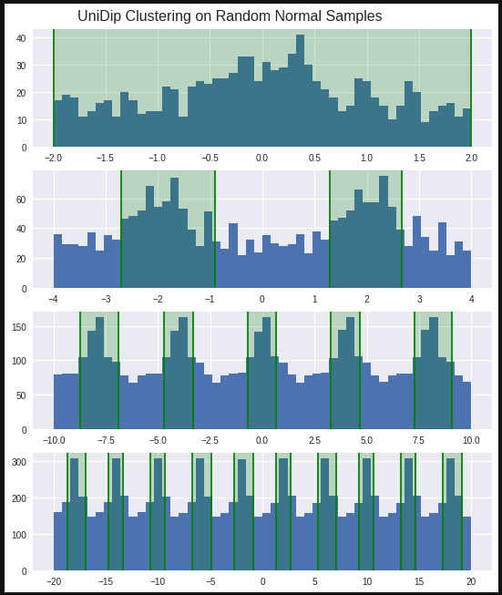

# Methodology

In this section We will explain UniDip and SkinnyDip's function as well as their underlying components. And, we will detail what steps we took to apply this family of algorithms to the problem of motif discovery.

## How SkinnyDip Functions

The SkinnyDip algorithm is able to find multi-dimensional clusters in continuous numeric distributions. It can perform this feat by composing itself of several layers. At its heart is the Hartigan Test of Unimodality [@hartigan_dip_1985], this formal statistical test is not terribly well known outside of its statistical circles, but does provide some useful features including speed, possessing linear time complexity, and non-parametric compatibility to any unimodal distribution, for instance Gaussian, Uniform, or Beta distributions. UniDip, SkinnyDip's univariate version, recursively performs the dip-test along one dimension isolating peaks in frequency. SkinnyDip itself recursively runs UniDip across each dimension then merging each dimension's clusters to find their intersections.

### Hartigan's Dip Test of Unimodality

In more detail, Hartigan's dip-test makes use of a distribution's empirical cumulative distribution function (ECDF). As can be seen from the plot below, this function's gradient increases approaching a peak in the histogram, and decreases after. In unimodal data, this creates a stretched S shape.


The dip-test performs a best fit to this shape, finding an minimal width path such that, from left to right on the `x` axis, in the beginning the gradient only increases until it reaches a point where-after the gradient only decreases. The dip statistic is defined as the width of this path divided by two, and does not vary with shifting or scaling.

Upon return of this dip statistic we may compare against a suitable unimodal null distribution, Hartigan suggests that, to obtain a p-value, the Uniform distribution is preferred [@hartigan_dip_1985]. If the p-value is greater than `alpha` we accept the null hypothesis that the distribution is unimodal, otherwise we accept the alternative that the distribution is _at least_ bi-modal.

The dip statistic and p-value are not enough in themselves to help us locate peaks. However, the dip-test also provides a modal interval, which specifies a lower and upper index to the isolated cluster. From this four pieces of information we can begin to search a univariate dataset.

### UniDip, Recursive Application of the Dip Test

UniDip takes us the next step by allowing us to recursively search a data sample to find peaks of density. We start by dipping along the entire single dimensional set of data. If the data is unimodal than we should return the set of data as the modal interval. otherwise we should perform UniDip within our located modal interval. We then try to take the same steps to the left and right of the modal interval. Since the dip-test can only differentiate between unimodal and bimodal or more distributions, to determine if there are indeed peaks of interest to the left or right we need to include the left-most or right-most detected peak. By including left-most or right-most peak, the dip-test will only show evidence for multiple peaks if there are indeed additional peaks to the left or right.

UniDip in condensed pseudo-code:

```pseudocode
INPUT: X, (1d sorted vector)
    alpha, (significance level)
        gamma, (is modal interval always true at start)

OUTPUT: set of modal intervals
        where a modal interval := (lower index, upper index)

UniDip(X, alpha=0.05, gamma=True)
    dip, pval, li, ui = DipTest(X)

    if pval > alpha return (if gamma) ? (X[0], X[-1]) : (li, ui)

    // recurse into interval
    Mm = UniDip(X[li, ui], alpha, gamma=True)

    // find left and right most intervals
    U = min(Mm, key=>(t) t[-1]); L = max(li, key=>(t) t[0])

    // check if left side is at least bi-modal when including
    // the left most mode then do same check but to the right
    pL = DipTest(X[X <= U]); pU = DipTest(X[X >= L])

    // recurse left if at least bi-modal
    Ml = (if pL <= alpha) ? UniDip(X[X < li], alpha, False) : ()

    // recurse right if at least bi-modal
    Mu = (if pU <= alpha) ? UniDip(X[X > ui], alpha, False) : ()

    return Mm & Ml & Mu
```

At the end of running this algorithm we collect the union of the all our recursive steps. We may need to merge any touching intervals, but none will overlap.

### SkinnyDip Recursive Application of UniDip

The SkinnyDip algorithm is just another layer on top of UniDip.

```pseudocode
for each dimension
     get UniDip intervals
     within each interval
         get SkinnyDip hyperinterval from subsequent dimension
return hyperintervals
```
We recursively run UniDip on each dimension, and, in the event that we find clusters, we check the subsequent dimensions to determine intersections. In 2 dimensions our intersections or "hyper-intervals" will be squares, in 3 dimensions they will be cubes. Maurus and Plant included in their paper a method to extract more useful projections of the data [@maurus_skinny-dip:_2016], but it is beyond the scope of this project. Indeed this multi-variate layer of SkinnyDip is beyond the scope of this project. While motif discovery starts with data in the form of many 1000bp long genomic sequences, our aim is to measure the level of nucleotide conservation, a potentially univariate metric. We have seen already representations such as frequency and information content measure conservation, distilling those representations down to a single metric or score will allow us to isolate motifs with the univariate UniDip algorithm.

### Implementing the Basic UniDip Algorithm

Before attempting to introduce any symbolic letter-based data we implemented our version of the UniDip algorithm in Python to the same specifications as the original UniDip source code [@samhelmholtz_skinny-dip:_2017]. The only real challenge we faced in implementing this algorithm is that there are very few libraries for calculating the Hartigan dip statistic. We settled on an implementation by Johannes Bauer [@bauer_dip_test:_2018] because its test suite proves it gives the same results, to within 8 decimal places, as those of the R package used by the original UniDip algorithm.

Bauer's dip implementation is slightly limited in that while it does calculate the dip statistic, it does not calculate a p-value for that statistic. To run a dip test, we calculate the dip in our data and then compare against a null distribution of dip statistics generated from a random samples of the standard uniform distribution as recommended by Hartigan [@hartigan_dip_1985]. Since, for the most part we would like to find mode clusters with a significance "alpha" of 0.05, we can run a dip test to this significance with `N = 1000` samples. While our approach is effective for this prototype stage, it is not optimal for two reasons. One, we are introducing randomness into an otherwise deterministic algorithm. And two, generating 1000 samples every time we need a p-value is a drain of computational resources. Martin Mächler has already studied these issues and found that p-value estimates can be interpolated from generated tables for much faster and deterministic performance [@machler_diptest-issues.pdf_nodate]. If we move forward with this algorithm, one necessary step will be implementing this type of p-value look up table. But, currently our basic testing against the uniform distribution is sufficient.

After implementing the basic UniDip algorithm and Hartigan dip test we are able to isolate peaks in univariate numeric samples. We successfully tested our implementation with concatenated random samples from normal distributions, with 1, 2, 5, and 10 peaks among 80% noise. 



As we can see from this image, UniDip is able to isolate the regions of higher density. Returning the lowest and highest index of the clusters from the sorted dataset. If we would like to take this algorithm to genomic data we will need to make modifications.

## Applying to Histogram Data

The core of UniDip, Hartigan's dip-test only requires access to the ECDF of the data. Thus,any data we would like to cluster must be reducible to an ECDF. An ECDF can be calculated either directly from the sample of a continuous random variable, or an approximation can be made from the `y` coordinates of the bins in a histogram.

**Sample from continuous random variable as X:**

$$\text{ECDF } = X_1 ... X_n / max(X)$$

**From histogram bin heights as H:**

$$\text{ECDF } = \frac{H_k}{n} \in H \text{,  where:} H_k = \sum_{i=1}^{k}H_i$$

In case of a random continuous variable we will inevitably lose detail by grouping points together, but we can reduce this loss by increasing the number of bins. 


In this image we plot a random sample of 500 points from a normal distribution, and generate a reasonable estimate of the ECDF from the cumulative sum of the histogram bin heights.

The reason it is useful to generate an ECDF from histogram heights, is because thinking back to the sequence logos, we can find a lot of similarities to a histogram. Each position can be compared to a bin, with the height determined by the frequency or information content in that position.


We can see the use in pushing histogram data through UniDip, but one assumption of the algorithm need to be changed for this type of data to be accepted. by default UniDip frequently sorts the data lowest to highest. This makes sense with a random sample where order is only determined by value and not position, and generating an ECDF from a raw sample requires sorted data, but with histogram data position is order and sorting by value will destroy that order.

This problem with sorting springs up in even more obscure parts of the algorithm. When presented with unimodal data Hartigan's dip-test will tend to return an extremely narrow model interval. This is not a huge problem when looking at the entire data sequence or when recursing into the modal intervals because we can simply return the end points of the data.

```pseudocode
if unimodal
    return if modal_interval ? (X[0], X[-1]) : (DIP[lower], DIP[upper]);
```

However, we run into an issue when recursing to the left or right of the modal interval. If there is only one modal peak, following the pseudo code from above, we will return an interval cutting off a large portion of the peak's tails. The solution to expanding the modal interval that Maurus and Plant developed is to "mirror" the data, such that if our data is `[1, 2, 3]` the mirrored dataset is `[-2, -1, 0, 1, 2]`. What this means is that when we are recursing to the left or right and we know we have found a single peak, we will perform the dip test on a bimodal mirror-set of the data to extract the whole peak. 

Data mirroring becomes a problem when applied to histogram data because the specific algorithm Maurus and Plant use sorts by value. To allow histogram data, We replaced this with own mirror function that flips the data by index rather than value. 

```pseudocode
if flip_left:
    mirror_data = concatenate((flip(X[1:]), X))
else:
    mirror_data = concatenate((X[:-1], flip(X)))
```

Making these modifications we are able to apply the UniDip algorithm to histogram data and isolate the same clusters as we would using the raw random samples.


## Applying to Symbolic Data

Taking the next step, we can apply UniDip to symbolic data. We will start on the simplest data we can generate. Our motif will be a 15bp long poly-A sequence with no mutations. We will surround this sequence on each side with a 100bp background sequence of 1/4 uniform sampling of all four nucleotides. We will generate 20 sequences of this type and visualize them with some current common metrics, specifically point frequency and information content.


The first item to notice about both these metrics is that they are calculated individual by base. We have separate measurements each for Adenine, Cytosine, Guanine, and Thymine. This can be important later on in representing motifs as we do care to know if position `i` is always "A" or perhaps can be either "A" or "C". At this stage, we care about a general metric that measures overall conservation so that we can find the location of the motif. We can let later analysis uncover the individual nucleotide differences.

We can get this overall metric with expected information also called entropy, which can be calculated at each position as the sum of each base's information weighted by its percentage. 

**Entropy:**

$$H=-\sum_{i=1}^{n}P(x_i)\log_2(P(x_i))$$ 

Applying an entropy calculation column-wise along the sequence will let us measure general conservation non-specific to any particular nucleotide. But, entropy by itself is not well suited to UniDip. We can see from looking at the plot of individual information content above that higher scores of information content actually correspond to less frequency, and lower scores to higher conservation. This makes sense because a sequence that is always a single symbol cannot convey any information. In our case, we would like to invert the Y axis, and scale to above 0, such that our metric matches the format of histogram data that we have already shown to perform well. Making this transformation, we can visualize our simple sequence as scaled negative entropy (SNE).


We can see our metric shows a high peak in the region of the poly-A motif, indicating its exact conservation. The surrounding regions vary with each position, but do not match the height of our generated motif.

By default, passing in this unimodal data into UniDip would just return back all our data as a single cluster. We can make another change to the algorithm. So that in the event that we return a single cluster we perform data mirroring to isolate just the region of high conservation.


Our cluster in this case span from 100-116, Our actual motif is from 100-115. UniDip does not provide an exact match, but that is to be expected. As with any clustering or motif discovery algorithm, this is the start of the search. We can provide areas of interest and rank those results, but further analysis and verification are always needed. This is true for current tools like MEME, AlignACE, or WEEDER, and it is true for UniDip as well.

### Applying to Multi-Symbol Motifs

Continuing on to increasingly difficult data, we can work with motifs that are not all the same nucleotide. Our motif will be the 15bp long sequence `ACTGTGCACGTGACG` with no mutations. Other parameters to the background sequence remain the same. Visualizing with our SNE metric it is hard to see much of a difference.


It is only when looking at the individual metrics that we can see the difference.


This consistency of our metric shows why it is important to have a grouped single metric. While the conservation of each nucleotide varies wildly, the combined conservation shows clearly where our motif is positioned. UniDip is completely able to handle multi-symbol motifs as represented with SNE.


### Applying to Degenerate Data

Increasing the challenge we introduce mutations into our motif such that conservation is no longer consistent through our motif. We introduced 6 mutations into each instance of the motif across the 20 samples, with few effects.


 We did notice a slight decrease in reliability where depending on the dataset, UniDip would isolate a larger region that usual. Such occurrences are rare though. Over 1000 trials the length of the returned cluster was longer than 17bp or less than 13bp in only 2% of cases. And all overlapped with the motif's location.

## Applying to Differently Aligned Motifs

UniDip is heavily reliant on the alignment of sequences to be able to measure nucleotide conservation. Even a misalignment of few nucleotides can obfuscate our entropy calculations. Thus, misaligning motifs is the largest challenge in applying UniDip to motif discovery. For reference, compare the below SNE plots that show data sets of 20 sequences, in one we have added a random +/-5bp misalignment the other has perfect alignment.


This problem with misalignment could possibly be alleviated by increasing the amount of data. Once we have enough sequences the motifs overlap enough that we can detect the conservation. For 15bp motifs with mis-alignments of +/-5 adjacent positions, assuming uniform dispersion, we would need at least 5 samples before we could expect a perfect alignment and 10 before we could be assured of a perfect alignment. This also means that the conservation would grow not just at a single motif site but at all the overlapped motif sites. For the 15bp motif, conservation would increase in a 25bp region. 

In real sequence motif discovery we can make very few assumptions on where the motif instances will fall [@hannenhalli_eukaryotic_2008]. The general assumption for TFBS's is that, both with single-species co-regulated genes and across species orthologs, the TFBS will fall anywhere within 1000bp upstream of the transcription start site, though there are exceptions. With misalignments of 1000bp, we would only expect to there to be a perfect alignments by chance after collecting 500 sequences. This requirement for data samples is multiple orders of magnitude larger than other motif finding algorithms, including MEME and AlignACE.

We can shrink this number of required samples by using global alignments. The MUSCLE alignment tool [@edgar_muscle:_2004], performs a multi-sequence alignment minimizing the number of mutations, insertions, and deletions as much as possible. Other alignment tools exist and an in-depth comparison of their merits is warranted for further research, but we only be using MUSCLE for this project. By using a global alignment we are able to move motif instances to overlap more and boost their conservation as measured by our SNE metric. Of course, performing the alignment does introduce its own issues. First, we are introducing gaps where previously our sequences were contiguous. Second, because MUSCLE is actively forcing the sequences to align better, we can no longer claim our metric is directly measuring sequence conservation. However, we can make adjustments to handle these issues. 

Regarding the introduction of gaps the complications arise from needing to handle a new symbol "-" indicating an insertion, it is not immediately clear how we should count this insertion, if we don't want to count insertions we might initially think just not count the gaps or set them to 0. However remembering that as part of our SNE metric we divide by the counts of each base having sections of nothing counted could lead to its own problems. Instead, for any insertion we find we add a tally to all other bases, this has the effect where positions with many insertions have there conservation level lowered as the counts of bases at that position become more similar. 

So, is this enough to be able to effectively handle misalignments? Generating 20 sample sequences with a motif at a random misalignment of +/-10bp we see that a high peak where our motifs have been aligned. After, running UniDip on this data, though, we notice a problem. We are now clustering not just our motif but all alignments as well. This is because we now see three levels of conservation, the gaps, the background sequence, and the motif. UniDip is unable to find nested clusters, where where there are multiple steps of density. 


We are able to get around this by trimming the gaps from our data. We can see that the gaps are at a relatively even level of 0.1 SNE. By filtering and concatenating only regions that are greater than that cutoff we are able to correctly isolate just the motif again.


Removing these might present a problem for being able to map back to the original sequence instances, but by keeping track of the aligned indices while performing the filtering we are able to maintain our ability to map back to the original instances.

### Filtering Out Spurious Motifs

By aligning our data, we also increase the chances of creating spurious motifs that have simply arisen from random chance. While it is challenging to completely remove these spurious motifs we can try to gauge how likely it is that our motifs are real. The simplest method we can use is to take the average SNE across each cluster, to give us an approximation of conservation in that region. This scoring is limited in meaning due to the alignment process interfering with our understanding of the conservation of the original sequences, but the scoring does provide a way to rank isolated clusters. 

We can see in this dataset of 50 samples of length 200 and possible misalignment up +/-50, that even after global alignment and gap trimming we have multiple isolated regions. 


Counting clusters left to right, if we take the average SNE, we can see that the score correlates reasonably well to our root squared error, where we define error as the positional distance from where we predict the motif to start (the cluster start site), and the true motif instance start site.


## Methodology Summary

In this section we have shown the methods that make it possible to isolate motifs from symbolic genomic data using the UniDip algorithm. We have found that scaled negative entropy is easily utilized by UniDip and well represents positional conservation. SNE mitigates the challenges of multi-symbol degenerate motifs very well, though it does falter when facing misaligned motif instances. To mitigate this factor, we brought the global alignment tool MUSCLE, which allows us to extend the level of misalignment of sequence instances. As part of that alignment we found that we increase the chances of encountering spurious motifs, but scoring and ranking each cluster by mean SNE allows us to better recognize true motifs.