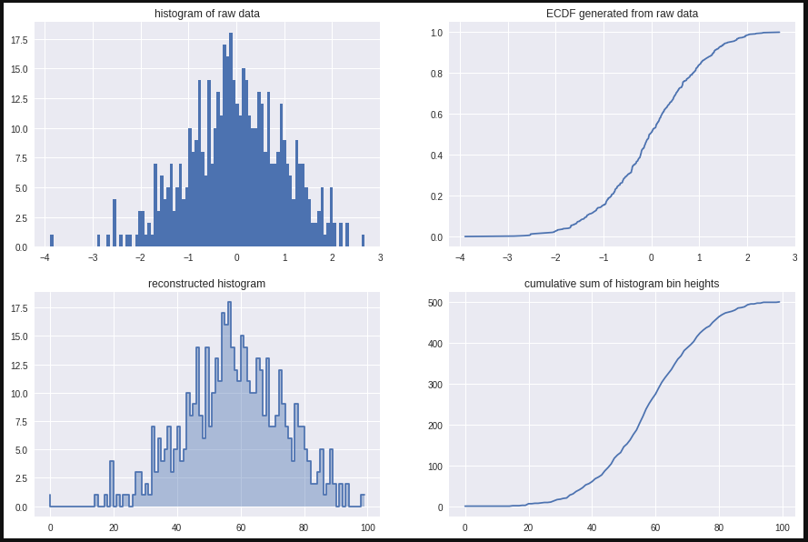
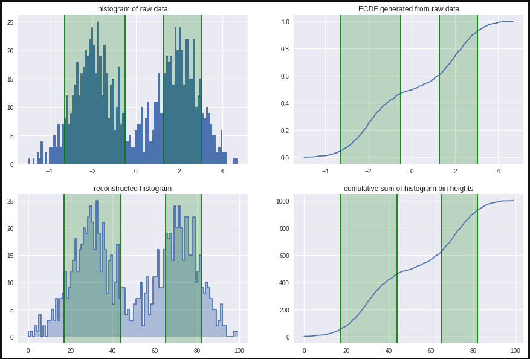
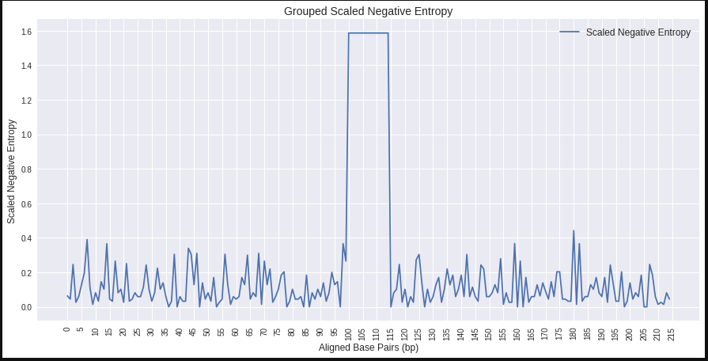
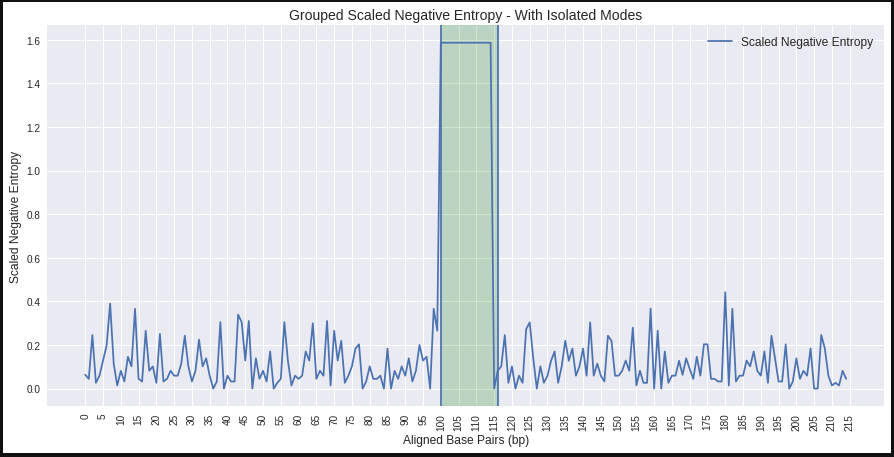
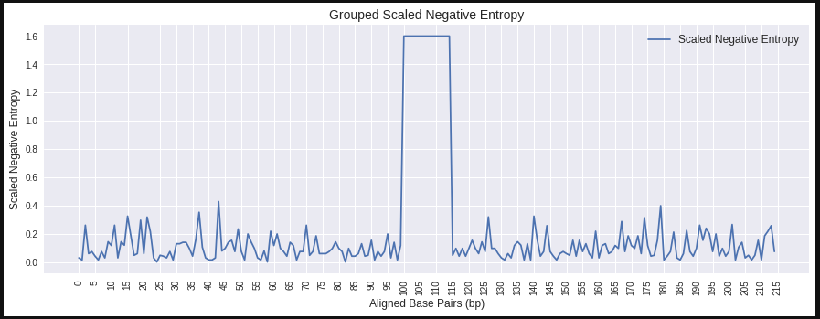
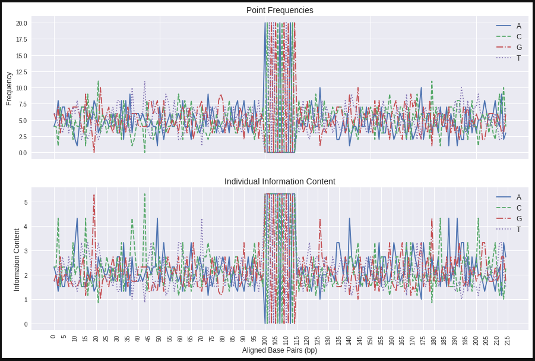
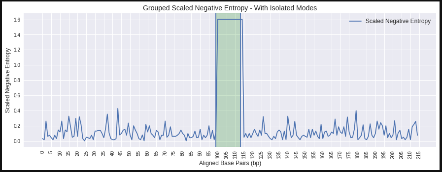
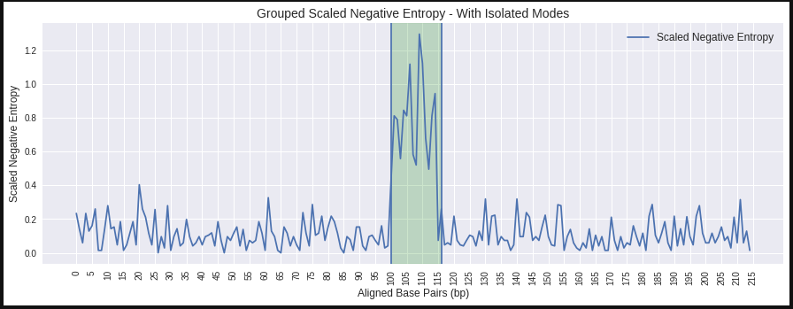

# Methodology

If we would like to take UniDip to genomic data we will need to make modifications, by both transforming the data and the algorithm itself. In this section we will detail what steps we took to apply the SkinnyDip family of algorithms to symbolic data.

## Applying to Histogram Data

To start, we will make some changes to the UniDip algorithm so that it can work with more discrete forms of data. The core of UniDip, Hartigan's dip-test, only requires access to the ECDF of the data. Thus, any data we would like to cluster must be reducible to an ECDF. An ECDF can be calculated either directly from the sample of a continuous random variable, or an approximation can be made from the `y` coordinates of the bins in a histogram.

**Sample from continuous random variable as X:**
$$\text{ECDF } = X_1 ... X_n / max(X)$$

**From histogram bin heights as H:**
$$\text{ECDF } = \frac{H_k}{n} \in H \text{,  where:} H_k = \sum_{i=1}^{k}H_i$$

In case of a random continuous variable we will inevitably lose detail by grouping points together, but we can reduce this loss by increasing the number of bins. 



In this image we plot a random sample of 500 points from a normal distribution, and generate a reasonable estimate of the ECDF from the cumulative sum of the histogram bin heights.

The reason it is useful to generate an ECDF from histogram heights, is because thinking back to the sequence logos, we can find a lot of similarities to a histogram. Each position can be compared to a bin, with the height determined by the frequency or information content in that position.


We can see the use in pushing histogram data through UniDip, but one assumption of the algorithm need to be changed for this type of data to be accepted. by default UniDip frequently sorts the data lowest to highest. This makes sense with a random sample where order is only determined by value and not position, and generating an ECDF from a raw sample requires sorted data, but with histogram data position is order and sorting by value will destroy that order.

This problem with sorting springs up in even more obscure parts of the algorithm. When presented with unimodal data Hartigan's dip-test will tend to return an extremely narrow model interval. This is not a huge problem when looking at the entire data sequence or when recursing into the modal intervals because we can simply return the end points of the data.

```pseudocode
if unimodal
    return (if isMod) ? (X[0], X[-1]) : (Mod[0], Mod[-1])
```

However, we run into an issue when recursing to the left or right of the modal interval. If there is only one modal peak, following the pseudo code from above, we will return an interval cutting off a large portion of the peak's tails. The solution to expanding the modal interval that Maurus and Plant developed is to "mirror" the data, such that if our data is `[1, 2, 3]` the mirrored dataset is `[-2, -1, 0, 1, 2]`. What this means is that when we are recursing to the left or right and we know we have found a single peak, we will perform the dip test on a bimodal mirror-set of the data to extract the whole peak. 

Data mirroring becomes a problem when applied to histogram data because the specific mirroring algorithm Maurus and Plant use sorts by value. To allow histogram data, We replaced this with own mirror function that flips the data by index rather than value. 

```pseudocode
if flip_left:
    mirror_data = concatenate((flip(X[1:]), X))
else:
    mirror_data = concatenate((X[:-1], flip(X)))
```

Making these modifications we are able to apply the UniDip algorithm to histogram data and isolate the same clusters as we would using the raw random samples.



## Applying to Symbolic Data

Taking the next step, we can apply UniDip to symbolic data. We will start on the simplest data we can generate. Our motif will be a 15bp long poly-A sequence with no mutations. We will surround this sequence on each side with a 100bp background sequence of 1/4 uniform sampling of all four nucleotides. We will generate 20 sequences of this type and visualize them with some current common metrics, specifically point frequency and information content.


The first item to notice about both these metrics is that they are calculated individually by base. We have separate measurements each for Adenine, Cytosine, Guanine, and Thymine. This can be important later on in representing motifs as we do care to know if position `i` is always "A" or perhaps can be either "A" or "C". At this stage though, we want to measure overall conservation so that we can isolate the motif regardless of its specific pattern. We can let later analysis uncover the individual nucleotide differences.

We can get this overall metric with expected information content also called entropy, which can be calculated at each position as the sum of each base's information weighted by its percentage. 

**Entropy:**
$$H= -\sum_{i=1}^{n} P(x_i) \log_2(P(x_i))$$ 

Applying an entropy calculation column-wise along the sequence will let us measure general conservation non-specific to any particular nucleotide. But, entropy by itself is not well suited to UniDip. We can see from looking at the plot of individual information content above that higher scores of entropy actually correspond to less frequency. This makes sense because a sequence that is always a single symbol cannot convey any information. In our case, we would like to invert the Y axis, and scale to above 0, such that our metric matches the format of histogram data that we have already shown to perform well. We can do this by subtracting the positional entropy from the max score possible with for possible nucleotides $2-H(X)$. Making this transformation, we can visualize our simple sequence as scaled negative entropy (SNE).



We can see our metric shows a high peak in the region of the poly-A motif, indicating its conservation. The surrounding regions vary with each position, but are nowhere near the height of our generated motif.

By default with unimodal data, UniDip would return back all our data as a single cluster. We can make another change to the algorithm. So that in the event that we return a single cluster, we subsequently perform data mirroring to isolate the single region of highest conservation.



Our cluster in this case span from 100-116, Our actual motif is from 100-115. In this simple example UniDip provides a very close match, and for such simple examples UniDip could be used on its own for motif discovery. Real genomic sequences are much more complex, but this example does show that we are able to isolate a region of high conservation in symbolic data via a relatively small data transform.

### Applying to Multi-Symbol Motifs

Because SNE is a aggregated metric, a function of position, we can work with motifs that are not all the same nucleotide. Our motif will be the 15bp long sequence `ACTGTGCACGTGACG` with no mutations. Other parameters to the background sequence remain the same. Visualizing with SNE it is hard to see much of a difference.



It is only when looking at the individual metrics that we can see the difference.



This consistency of our metric shows why it is important to have this grouped single metric. While the conservation of each nucleotide varies wildly, the combined conservation shows clearly where our motif is positioned. UniDip is completely able to handle multi-symbol motifs as represented with SNE.



### Applying to Degenerate Data

Introducing mutations does increase the difficulty in finding the regions of conservation because conservation is lowered closer to the background sequence. We introduced 6 mutations into each instance of the motif across the 20 samples, with few effects.



But higher levels of degeneracy do have an effect making UniDip return a wider interval. In this case we increase degeneracy to 10 potential mutations per instance.  


This level of degeneracy is high for a motif, but a similar effect will be seen where the background sequence becomes more conserved. With less of a threshold between the signal and background UniDip is apt to lose specificity. UniDip is still useful even when it is unable exactly match motif sites. Note that the cluster above still contains the motif instances and has by exclusion marked out a large portion of the sequence to rule out. UniDip has narrowed the search space considerably.

## Applying to Differently Aligned Motifs

UniDip is heavily reliant on the alignment of sequences to be able to measure nucleotide conservation. Even a misalignment of few nucleotides can obfuscate our entropy calculations. Thus, misaligning motifs is the largest challenge in applying UniDip to motif discovery. For reference, compare the below SNE plots that show data sets of 20 sequences, in one we have added a random +/-5bp misalignment the other has perfect alignment.


This problem with misalignment could possibly be alleviated by increasing the amount of data. Once we have enough sequences the motifs overlap enough that we can detect the conservation. For 15bp motifs with mis-alignments of +/-5 adjacent positions, assuming uniform dispersion, we would expect a single perfect alignment after sampling 5 times and 10 samples before we could be assured of a single perfect alignment. This also means that the conservation would grow not just at a single motif site but at all the overlapped motif sites. For the 15bp motif, conservation would increase in a 25bp region. 

In real sequence motif discovery we can make very few assumptions on where the motif instances will fall [@hannenhalli_eukaryotic_2008]. The general assumption for TFBS's is that, both with single-species co-regulated genes and across species orthologs, the TFBS may fall anywhere within 1000bp upstream of the transcription start site. With misalignments of 1000bp, we would only expect to there to be a perfect alignments by chance after collecting 500 sequences. This requirement for data samples is multiple orders of magnitude larger than other motif finding algorithms, including MEME and AlignACE.

We can shrink this number of required samples by using global alignment tools. The MUSCLE alignment tool [@edgar_muscle:_2004], performs a multi-sequence alignment minimizing the number of mutations, insertions, and deletions as much as possible. Other alignment tools exist and an in-depth comparison of their merits is warranted for further research, but we will only be using MUSCLE for this project. By using a global alignment we are able to move motif instances to overlap more and boost conservation in select regions. Of course, performing the alignment does introduce its own issues. First, we are introducing gaps where previously our sequences were contiguous. Second, because MUSCLE is actively forcing the sequences to align better, we can no longer claim our metric is directly measuring sequence conservation. However, we can make adjustments to handle these issues. 

Regarding the introduction of gaps the complications arise from needing to handle a new symbol "-" indicating an insertion, it is not immediately clear how we should count this insertion, if we don't want to count insertions we might initially think just not count the gaps or set them to 0. However, remembering that entropy calculations divide by the counts of each base, having sections of $0$ could lead to division errors. Instead, for any insertion we find we add a tally to all other bases, this has the effect where positions with many insertions have their conservation level lowered as the counts of bases at that position become more similar. 

So, is this enough to be able to effectively handle misalignments? Generating 20 sample sequences with a motif at a random misalignment of +/-10bp we see that a high peak where our motifs have been aligned. After, running UniDip on this data, though, we notice a problem. We are now clustering not just our motif but all alignments as well. This is because we now see three levels of conservation, the gaps, the background sequence, and the motif. UniDip is unable to find nested clusters, where there are multiple steps of density. 


We are able to get around this limitation by trimming the gaps from our data. We can see that the gaps are at a relatively even level less than 0.1 SNE. By filtering and concatenating only regions that are greater than that threshold we are able to correctly isolate just the motif again.


Removing these gaps might present a problem for being able to map back to the original sequence instances, but by keeping track of the aligned indices while performing the filtering we are able to maintain our ability to map back to the original instances.

## Methodology Summary

In this section we have shown the methods that make it possible to isolate regions of conservation from symbolic genomic data using the UniDip algorithm. We have found that scaled negative entropy is easily utilized by UniDip and well represents positional conservation. SNE mitigates the challenges of multi-symbol degenerate motifs very well, though it does falter when facing misaligned motif instances. To mitigate this factor, we used the global alignment tool MUSCLE, which allows us to concentrate motif instances in select regions. And by trimming gaps, we are able to isolate regions of conservation from the background sequence.